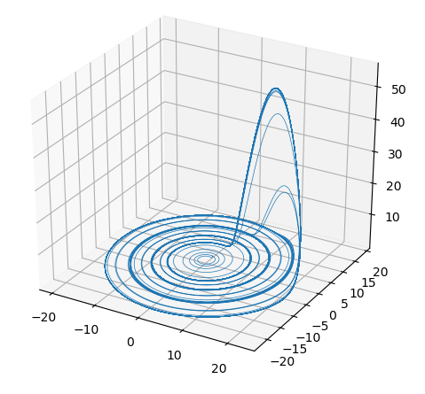
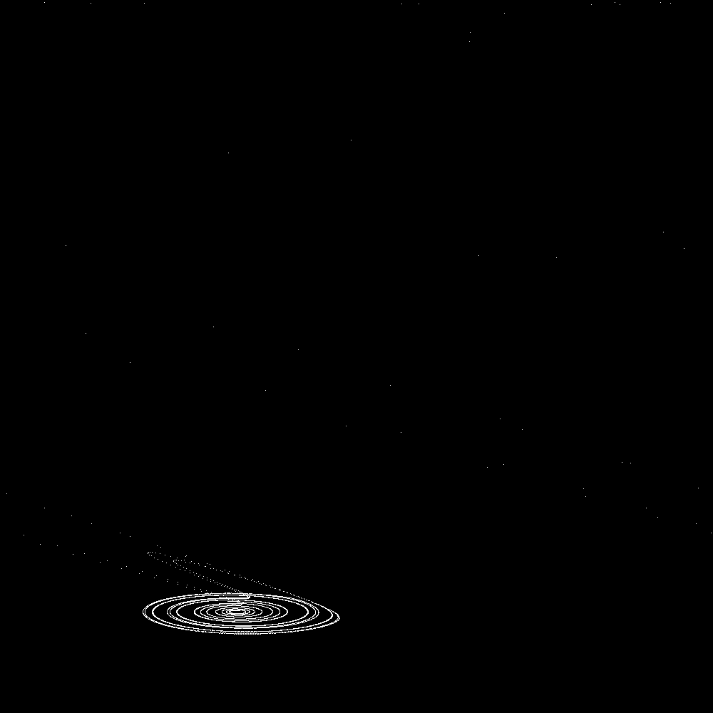

#   Roessler

1.  `roessler`, a library which solves the differential equations producing the Roessler Strange Attractor.

2.  `lazytrig`, a transcendental functions library, providing sine, cosine, logarithm, exponential, etc., in `@rs`.

3.  `proj-3d`, a generator which takes the 3D coordinates produced by `roessler` and produces either a list of 2D points or a full 2D PPM image.

These programs are available for use on Urbit under the MIT License.

##  Novel Features

1.  Differental Equation Solver.  I created a Runge-Kutta fourth-order differential equation solver, `++dxdt:roessler` and variants.  These are currently hard-coded to the Roessler calculations at `++xf:roessler` etc. but are flexible for any other appropriate gates.

    Example Usage:
    
        /+  roessler
        ::  Render 1,000 3D points at a dx of 0.01.
        (genxyz-pts:roessler 1.000 .0.01)
    
    Example Output (100,000 points rendered with Python):
    
    

2.  Transcendental Functions Library.  I wrote a series-based mathematical functions library to support `proj-3d`.  It is unjetted, but supports sine, cosine, tangent, logarithms, arbitrary powers, and exponentiation.

    Usage:
    
        /+  lazytrig
        ::  Calculate sine(pi/4)
        (sine:lazytrig (div:rs pi:lazytrig .4))

3.  2D Projection of 3D Points.  I implemented the matrix mathematics necessary to convert 3D points to a 2D plane with perspective view.  (Alas, using only lists of lists of `@rs` as the linear algebra library is developed independently.)

    Usage:
    
        /+  roessler
        ::  Render 1,000 points at a dx of 0.01.
        (genxyzs:roessler 1.000 .0.01)

4.  In-Urbit Rendering of 3D Points.  I implemented a PPM rendering which creates a black-and-white image of the 2D points.

    Usage:
    
        ::  Render a 1,000×1,000 image of 10,000 Roessler points.
        (gen3d-ppm (ravel-3d-pts (gen-3d-pts 1.000 10.000) 1.000))
    
    Output (PPM file converted to PNG):
    
    
